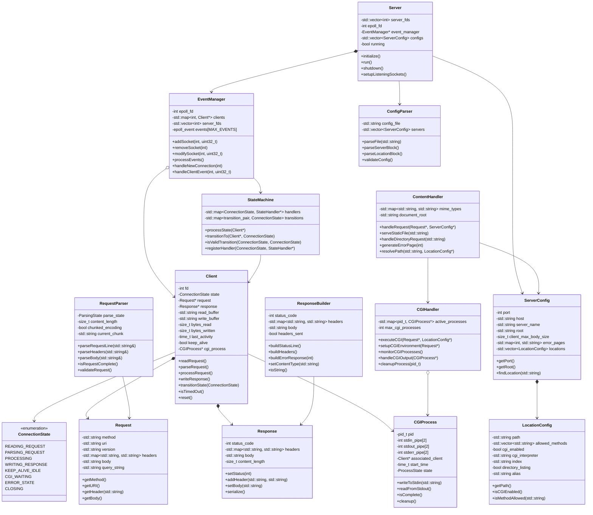

# Webserv - High-Performance HTTP Server

[](https://42.fr)
[](https://isocpp.org/)
[](LICENSE)

> A high-performance HTTP/1.1 server implementation mimicking nginx architecture, built as part of the 42 School curriculum.

## Table of Contents

- [Overview](#overview)
- [Features](#features)
- [Architecture](#architecture)
- [Installation](#installation)
- [Usage](#usage)
- [Configuration](#configuration)
- [API Documentation](#api-documentation)
- [State Machine](#state-machine)
- [Testing](#testing)
- [Contributing](#contributing)
- [License](#license)

## Overview

Webserv is a custom HTTP/1.1 server implementation that mimics nginx's single-threaded, event-driven architecture. Built with modern C++ and utilizing epoll for high-performance I/O multiplexing, it supports concurrent connections, static file serving, CGI execution, and flexible configuration.

### Key Design Principles

- **Event-driven architecture** with epoll for scalable I/O
- **State machine-based** connection handling
- **Non-blocking I/O** for high concurrency
- **Modular design** following nginx patterns
- **Zero external dependencies** (C++98 compliant)

## Features

- HTTP/1.1 Compliance - Full support for HTTP/1.1 specification
- High Performance - Epoll-based event loop handling thousands of connections
- Keep-Alive Connections - Connection reuse for improved performance
- Static File Serving - Efficient static content delivery with MIME type detection
- CGI Support - Execute CGI scripts with proper process management
- Directory Listing - Automatic directory index generation
- Flexible Configuration - Nginx-like configuration syntax
- Error Handling - Comprehensive HTTP error responses
- Multiple Virtual Hosts - Support for multiple server blocks
- Request Methods - GET, POST, DELETE support with per-location configuration

## Architecture

### Core Components

```
Server
├── EventManager (epoll loop)
│   ├── Client (state management)
│   │   ├── StateMachine
│   │   ├── RequestParser
│   │   └── ResponseBuilder
│   └── ContentHandler
│       └── CGIHandler
│           └── CGIProcess
├── ConfigParser
│   └── ServerConfig
│       └── LocationConfig
```

### Event Loop Architecture

```
┌─────────────┐    ┌──────────────┐    ┌─────────────┐
│   Server    │───▶│EventManager  │───▶│   Client    │
│             │    │(epoll loop)  │    │(state mgmt) │
└─────────────┘    └──────────────┘    └─────────────┘
       │                    │                   │
       ▼                    ▼                   ▼
┌─────────────┐    ┌──────────────┐    ┌─────────────┐
│ConfigParser │    │ContentHandler│    │StateMachine │
└─────────────┘    └──────────────┘    └─────────────┘
```

## Installation

### Prerequisites

- GCC 4.8+ or Clang 3.4+ (C++98 support)
- Linux (for epoll support)
- Make

### Build

```bash
# Clone the repository
git clone https://github.com/yourusername/webserv.git
cd webserv

# Build the project
make

# Optional: Build with debug symbols
make debug

# Clean build artifacts
make clean
```

### Build Targets

- `make` or `make all` - Build release version
- `make debug` - Build with debug symbols and verbose logging
- `make test` - Build and run unit tests
- `make clean` - Remove object files
- `make fclean` - Remove all build artifacts
- `make re` - Rebuild everything

## Usage

### Basic Usage

```bash
# Start server with default configuration
./webserv

# Start with custom configuration file
./webserv config/custom.conf

# Start with specific configuration and log level
./webserv config/production.conf --log-level=INFO
```

### Command Line Options

```bash
./webserv [config_file] [options]

Options:
  --help, -h          Show help message
  --version, -v       Show version information
  --log-level=LEVEL   Set logging level (DEBUG, INFO, WARN, ERROR)
  --daemon, -d        Run as daemon process
  --test-config, -t   Test configuration file syntax
```

### Testing the Server

```bash
# Test with curl
curl http://localhost:8080/

# Test POST request
curl -X POST -d "data=test" http://localhost:8080/cgi-bin/form.py

# Test with browser
open http://localhost:8080
```

## Configuration

Webserv uses nginx-like configuration syntax:

### Basic Configuration

```nginx
# webserv.conf

server {
    listen 8080;
    server_name localhost;
    root /var/www/html;
    index index.html index.htm;
    client_max_body_size 1M;
    
    # Error pages
    error_page 404 /errors/404.html;
    error_page 500 502 503 504 /errors/50x.html;
    
    # Main location
    location / {
        allow_methods GET POST;
        autoindex on;
    }
    
    # CGI location
    location /cgi-bin/ {
        allow_methods GET POST;
        cgi_pass /usr/bin/python3;
        root /var/www/cgi-bin;
    }
    
    # Upload location
    location /upload {
        allow_methods POST DELETE;
        client_max_body_size 10M;
        upload_store /var/www/uploads;
    }
}

# Additional server block
server {
    listen 8081;
    server_name example.com;
    root /var/www/example;
    
    location / {
        allow_methods GET;
        return 301 https://example.com$request_uri;
    }
}
```

### Configuration Directives

#### Server Block Directives

| Directive | Description | Default | Example |
|-----------|-------------|---------|---------|
| `listen` | Port to listen on | 80 | `listen 8080;` |
| `server_name` | Server hostname | localhost | `server_name example.com;` |
| `root` | Document root directory | /var/www/html | `root /path/to/files;` |
| `index` | Default index files | index.html | `index index.html index.php;` |
| `client_max_body_size` | Max request body size | 1M | `client_max_body_size 10M;` |
| `error_page` | Custom error pages | - | `error_page 404 /404.html;` |

#### Location Block Directives

| Directive | Description | Default | Example |
|-----------|-------------|---------|---------|
| `allow_methods` | Allowed HTTP methods | GET | `allow_methods GET POST DELETE;` |
| `autoindex` | Enable directory listing | off | `autoindex on;` |
| `cgi_pass` | CGI interpreter path | - | `cgi_pass /usr/bin/python3;` |
| `alias` | Location alias | - | `alias /different/path;` |
| `return` | Return specific response | - | `return 301 /new-location;` |

## API Documentation

### Core Classes

#### Server
Main server class handling initialization and lifecycle.

```cpp
class Server {
public:
    void initialize();           // Setup sockets and epoll
    void run();                 // Main event loop
    void shutdown();            // Graceful shutdown
private:
    std::vector<int> server_fds;
    EventManager* event_manager;
    std::vector<ServerConfig> configs;
};
```

#### EventManager
Epoll-based event loop manager.

```cpp
class EventManager {
public:
    void addSocket(int fd, uint32_t events);
    void removeSocket(int fd);
    void processEvents();
    void handleNewConnection(int server_fd);
    void handleClientEvent(int client_fd, uint32_t events);
private:
    int epoll_fd;
    std::map<int, Client*> clients;
    epoll_event events[MAX_EVENTS];
};
```

#### Client
Individual client connection with state management.

```cpp
class Client {
public:
    void readRequest();
    void parseRequest();
    void processRequest();
    void writeResponse();
    void transitionState(ConnectionState new_state);
private:
    int fd;
    ConnectionState state;
    Request* request;
    Response* response;
    std::string read_buffer;
    std::string write_buffer;
};
```

## State Machine

### Connection States

```cpp
enum class ConnectionState {
    READING_REQUEST,    // Reading HTTP request
    PARSING_REQUEST,    // Parsing complete request
    PROCESSING,         // Generating response
    WRITING_RESPONSE,   // Sending response
    KEEP_ALIVE_IDLE,    // Waiting for next request
    CGI_WAITING,        // Waiting for CGI completion
    ERROR_STATE,        // Error handling
    CLOSING             // Connection cleanup
};
```

### State Transitions

```
[NEW_CONNECTION]
       ↓
[READING_REQUEST] ←─────────────────┐
       ↓                            │
[PARSING_REQUEST]                   │ Keep-Alive
       ↓                            │ Loop
[PROCESSING] ──→ [CGI_WAITING]      │
       ↓              ↓             │
[WRITING_RESPONSE] ←───┘             │
       ↓                            │
[KEEP_ALIVE_IDLE] ──────────────────┘
       ↓
[CLOSING]

Error Path: Any State → [ERROR_STATE] → [CLOSING]
```

### State Handlers

Each state has a dedicated handler:

- **READING_REQUEST**: Non-blocking socket reads
- **PARSING_REQUEST**: HTTP request parsing and validation
- **PROCESSING**: Route resolution and response generation
- **CGI_WAITING**: Monitor CGI process completion
- **WRITING_RESPONSE**: Non-blocking response transmission
- **KEEP_ALIVE_IDLE**: Wait for next request or timeout

## Testing

### Unit Tests

```bash
# Run all tests
make test

# Run specific test suite
./tests/run_tests --suite=parser
./tests/run_tests --suite=config
./tests/run_tests --suite=state_machine
```

### Integration Tests

```bash
# HTTP compliance tests
./tests/integration/http_compliance_test.sh

# Load testing
./tests/load/siege_test.sh

# CGI functionality tests
./tests/integration/cgi_test.sh
```

### Manual Testing

```bash
# Test basic functionality
curl -i http://localhost:8080/

# Test CGI
curl -X POST -d "name=test" http://localhost:8080/cgi-bin/form.py

# Test file upload
curl -X POST -F "file=@test.txt" http://localhost:8080/upload/

# Test error handling
curl -i http://localhost:8080/nonexistent
```

### Performance Testing

```bash
# Apache Bench
ab -n 10000 -c 100 http://localhost:8080/

# Siege load testing
siege -c 50 -t 30s http://localhost:8080/

# Custom concurrent connection test
./tests/performance/connection_test 1000
```

## Contributing

### Development Setup

```bash
# Fork and clone the repository
git clone https://github.com/yourusername/webserv.git
cd webserv

# Create feature branch
git checkout -b feature/your-feature-name

# Make changes and test
make test

# Commit and push
git commit -m "feat: add your feature"
git push origin feature/your-feature-name
```

### Code Style

- Follow C++98 standard
- Use consistent indentation (tabs)
- Comment complex logic
- Write unit tests for new features
- Update documentation

### Pull Request Process

1. Ensure all tests pass
2. Update documentation if needed
3. Add tests for new functionality
4. Follow conventional commit messages
5. Request review from maintainers

## Project Structure

```
webserv/
├── src/                    # Source files
│   ├── server/            # Core server implementation
│   ├── http/              # HTTP parsing and handling
│   ├── config/            # Configuration parsing
│   ├── cgi/               # CGI execution
│   └── utils/             # Utility functions
├── include/               # Header files
├── config/                # Sample configuration files
├── tests/                 # Test suite
│   ├── unit/             # Unit tests
│   ├── integration/      # Integration tests
│   └── performance/      # Performance tests
├── docs/                  # Additional documentation
├── examples/              # Example configurations and CGI scripts
└── Makefile              # Build configuration
```

## Troubleshooting

### Common Issues

**Server won't start**
- Check if port is already in use: `netstat -tulpn | grep :8080`
- Verify configuration file syntax: `./webserv --test-config`
- Check file permissions for document root

**CGI scripts not executing**
- Verify CGI script permissions: `chmod +x script.py`
- Check interpreter path in shebang
- Verify `cgi_pass` directive in configuration

**High memory usage**
- Monitor connection count: `ss -tuln`
- Check for connection leaks in logs
- Adjust `client_max_body_size` if needed

### Debug Mode

```bash
# Enable debug logging
./webserv config.conf --log-level=DEBUG

# Use GDB for debugging
gdb ./webserv
(gdb) run config.conf
```

## License

This project is licensed under the MIT License - see the [LICENSE](LICENSE) file for details.

## Acknowledgments

- [42 School](https://42.fr) for the project specification
- [nginx](https://nginx.org) for architectural inspiration
- [RFC 7230-7235](https://tools.ietf.org/html/rfc7230) HTTP/1.1 specification
- [RFC 3875](https://tools.ietf.org/html/rfc3875) CGI specification

## Status

- ✅ HTTP/1.1 request parsing
- ✅ Static file serving
- ✅ CGI execution
- ✅ Configuration parsing
- ✅ Error handling
- ✅ Keep-alive connections
- ✅ Multiple virtual hosts
- 🚧 HTTPS support (future)
- 🚧 HTTP/2 support (future)

---

**Made with ❤️ by [Zineddaine Badr](https://github.com/Pedro-99)**
📊 Class Diagram




This architecture provides a solid foundation for a high-performance HTTP server that mimics nginx behavior while being educational and maintainable for the 42 webserv project.
